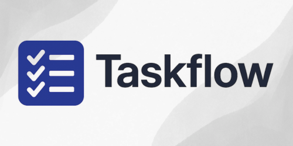

[](https://mseep.ai/app/pinkpixel-dev-taskflow-mcp)

# TaskFlow MCP 🔄✅

<p align="center">
  
</p>

A task management Model Context Protocol (MCP) server for planning and executing tasks with AI assistants.

<a href="https://glama.ai/mcp/servers/@pinkpixel-dev/taskflow-mcp">
  
</a>


## 🌟 Overview

TaskFlow MCP is a specialized server that helps AI assistants break down user requests into manageable tasks and track their completion. It enforces a structured workflow with user approval steps to ensure tasks are properly tracked and users maintain control over the process.

## ✨ Features

- 📋 **Task Planning**: Break down complex requests into manageable tasks
- 🔍 **Subtasks**: Divide tasks into smaller, more manageable subtasks
- 📊 **Progress Tracking**: Track the status of tasks, subtasks, and requests with visual progress tables
- 👍 **User Approval**: Enforce user approval steps to ensure quality and control
- 💾 **Persistence**: Save tasks and requests to disk for persistence across sessions
- 🔄 **Flexible Management**: Add, update, or delete tasks and subtasks as needed
- 📝 **Detailed Reporting**: View task details and progress tables
- 📤 **Export Options**: Export task plans and status reports in Markdown, JSON, or HTML formats
- 📦 **Dependencies**: Track project and task-level dependencies with version information
- 📌 **Notes**: Add project-level notes for important information and preferences
- 📄 **YAML Support**: Save tasks in YAML format for better handling of multiline content
- 🛡️ **Robust Text Handling**: Comprehensive newline sanitization for reliable data persistence
- 🎯 **Prompts System**: Global instructions and task prefix/suffix for consistent LLM guidance
- 📚 **Task Archiving**: Archive completed requests to keep active task lists clean
- 🗂️ **Archive Management**: Browse, search, and restore archived tasks with full history
- 📍 **Relative Path Support**: Use relative paths for flexible project-based workflows

## 🚀 Installation

### Global Installation

```bash
npm install -g @pinkpixel/taskflow-mcp
```

### Local Installation

```bash
npm install @pinkpixel/taskflow-mcp
```

## 🛠️ Usage

### Starting the Server

If installed globally:

```bash
taskflow-mcp
```

If installed locally:

```bash
npx taskflow-mcp
```

### Configuration

By default, TaskFlow MCP saves tasks to `tasks.yaml` in the current working directory. You can customize this by setting the `TASK_MANAGER_FILE_PATH` environment variable:

#### File Path Options

**Absolute paths** (recommended for production):
```bash
TASK_MANAGER_FILE_PATH=/home/user/projects/my-tasks.yaml taskflow-mcp
# Windows
TASK_MANAGER_FILE_PATH=C:\Users\username\Documents\tasks.yaml taskflow-mcp
```

**Relative paths** (great for project-based workflows):
```bash
# Resolves to ./project-tasks.yaml in the current directory
TASK_MANAGER_FILE_PATH=project-tasks.yaml taskflow-mcp

# Resolves to ./tasks/current.yaml relative to working directory
TASK_MANAGER_FILE_PATH=tasks/current.yaml taskflow-mcp
```

**Advanced: Custom base directory**
```bash
# Use a different base directory for relative path resolution
TASK_MANAGER_BASE_DIR=/home/user/workspace TASK_MANAGER_FILE_PATH=tasks.yaml taskflow-mcp
```

#### Cross-Platform Compatibility

TaskFlow MCP automatically handles path resolution across Windows and Linux:
- Uses Node.js `path.resolve()` and `path.normalize()` for consistent behavior
- Supports both forward slashes (`/`) and backslashes (`\`) on Windows
- Automatically creates parent directories when saving tasks
- Provides clear error messages for path resolution issues

#### YAML Format Support

TaskFlow MCP supports both JSON and YAML formats for data persistence. To use YAML format, simply configure your file path with a `.yaml` or `.yml` extension:

```bash
TASK_MANAGER_FILE_PATH=/path/to/tasks.yaml taskflow-mcp
```

YAML format is particularly useful for:
- Better preservation of multiline descriptions and text content
- More human-readable task data files
- Easier manual editing if needed

The format is automatically detected based on the file extension, and the system maintains full backward compatibility with existing JSON files.

#### Archive System

TaskFlow MCP v1.4.1 includes a comprehensive archive system to keep your active task lists clean while preserving completed work history:

```bash
# Configure archive file path (optional - defaults to [taskfile-name]-archive.[ext])
ARCHIVE_FILE_PATH=/path/to/tasks-archive.yaml taskflow-mcp

# Set archive mode (optional - defaults to 'manual')
ARCHIVE_MODE=manual taskflow-mcp  # or 'auto-on-complete'
```

Archive features include:
- **Manual archiving**: Use `archive_completed_requests` tool to archive when ready
- **Automatic archiving**: Set `ARCHIVE_MODE=auto-on-complete` for automatic archiving
- **Archive browsing**: Search and filter archived requests with `list_archived_requests`
- **Archive restoration**: Restore archived requests back to active status with `restore_archived_request`
- **Full history preservation**: Complete task history, timestamps, and metadata preserved

### MCP Configuration

To use TaskFlow MCP with AI assistants, you need to configure your MCP client to use the server. Create an `mcp_config.json` file with the following content:

**Basic Configuration:**
```json
{
  "mcpServers": {
    "taskflow": {
      "command": "npx",
      "args": ["-y", "@pinkpixel/taskflow-mcp"],
      "env": {
        "TASK_MANAGER_FILE_PATH": "/path/to/tasks.yaml"
      }
    }
  }
}
```

**Advanced Configuration (with all v1.4.1 options):**
```json
{
  "mcpServers": {
    "taskflow": {
      "command": "npx",
      "args": ["-y", "@pinkpixel/taskflow-mcp"],
      "env": {
        "TASK_MANAGER_FILE_PATH": "./project-tasks.yaml",
        "TASK_MANAGER_BASE_DIR": "/path/to/project/root",
        "ARCHIVE_FILE_PATH": "./tasks-archive.yaml",
        "ARCHIVE_MODE": "manual"
      }
    }
  }
}
```

**Configuration Options:**
- `TASK_MANAGER_FILE_PATH`: Path to tasks file (supports .json/.yaml, absolute/relative paths)
- `TASK_MANAGER_BASE_DIR`: Custom base directory for relative path resolution
- `ARCHIVE_FILE_PATH`: Path to archive file (optional, auto-generated if not specified)
- `ARCHIVE_MODE`: Archive mode - "manual" (default) or "auto-on-complete"

> 💡 **Tip:** See [examples/mcp_config_comprehensive.json](./examples/mcp_config_comprehensive.json) for a complete configuration example with detailed comments and usage examples.

## 🔄 Workflow

TaskFlow MCP enforces a specific workflow:

1. **Plan Tasks**: Break down a user request into tasks (with optional subtasks)
2. **Get Next Task**: Retrieve the next pending task
3. **Complete Subtasks**: If the task has subtasks, complete each subtask before marking the task as done
4. **Mark Task Done**: Mark a task as completed (requires all subtasks to be completed first)
5. **Wait for User Confirmation**: Ask the user to confirm the completed task before proceeding
6. **Repeat**: Continue with the next task until all tasks are complete
7. **Final Confirmation**: Confirm with the user that the entire request has been completed

For AI assistants to consistently follow this workflow, see the [example-system-prompt.md](./example-system-prompt.md) file for system prompts you can add to your assistant's instructions.

## 🧰 Available Tools

TaskFlow MCP exposes the following tools to AI assistants:

### `plan_task`

Register a new user request and plan its associated tasks (with optional subtasks).

```json
{
  "originalRequest": "Create a new website for my business",
  "outputPath": "C:/Users/username/Documents/website-project-plan.md",
  "dependencies": [
    {
      "name": "Node.js",
      "version": ">=14.0.0",
      "description": "JavaScript runtime"
    },
    {
      "name": "npm",
      "version": ">=6.0.0",
      "description": "Package manager"
    }
  ],
  "notes": [
    {
      "title": "Package Manager Preference",
      "content": "User prefers pnpm over npm for package management."
    },
    {
      "title": "Design Guidelines",
      "content": "Follow the company's brand guidelines for colors and typography."
    }
  ],
  "tasks": [
    {
      "title": "Design homepage",
      "description": "Create a design for the homepage with logo, navigation, and hero section",
      "dependencies": [
        {
          "name": "Figma",
          "description": "Design tool"
        }
      ],
      "subtasks": [
        {
          "title": "Design logo",
          "description": "Create a logo that represents the business brand"
        },
        {
          "title": "Design navigation",
          "description": "Create a user-friendly navigation menu"
        }
      ]
    },
    {
      "title": "Implement HTML/CSS",
      "description": "Convert the design to HTML and CSS",
      "dependencies": [
        {
          "name": "HTML5",
          "description": "Markup language"
        },
        {
          "name": "CSS3",
          "description": "Styling language"
        }
      ]
    }
  ]
}
```

### `get_next_task`

Retrieve the next pending task for a request.

```json
{
  "requestId": "req-1"
}
```

### `mark_task_done`

Mark a task as completed.

```json
{
  "requestId": "req-1",
  "taskId": "task-1",
  "completedDetails": "Created a modern design with a clean layout"
}
```


### `open_task_details`

Get details about a specific task.

```json
{
  "taskId": "task-1"
}
```

### `list_requests`

List all requests in the system.

```json
{}
```

### `add_tasks_to_request`

Add more tasks to an existing request.

```json
{
  "requestId": "req-1",
  "tasks": [
    {
      "title": "Add contact form",
      "description": "Create a contact form with validation"
    }
  ]
}
```

### `update_task`

Update a task's title or description.

```json
{
  "requestId": "req-1",
  "taskId": "task-1",
  "title": "Design responsive homepage",
  "description": "Create a responsive design for the homepage"
}
```

### `delete_task`

Delete a task from a request.

```json
{
  "requestId": "req-1",
  "taskId": "task-1"
}
```

### `add_subtasks`

Add subtasks to an existing task.

```json
{
  "requestId": "req-1",
  "taskId": "task-1",
  "subtasks": [
    {
      "title": "Design logo",
      "description": "Create a logo that represents the business brand"
    },
    {
      "title": "Design navigation",
      "description": "Create a user-friendly navigation menu"
    }
  ]
}
```

### `mark_subtask_done`

Mark a subtask as completed.

```json
{
  "requestId": "req-1",
  "taskId": "task-1",
  "subtaskId": "subtask-1"
}
```

### `update_subtask`

Update a subtask's title or description.

```json
{
  "requestId": "req-1",
  "taskId": "task-1",
  "subtaskId": "subtask-1",
  "title": "Design modern logo",
  "description": "Create a modern logo that represents the business brand"
}
```

### `delete_subtask`

Delete a subtask from a task.

```json
{
  "requestId": "req-1",
  "taskId": "task-1",
  "subtaskId": "subtask-1"
}
```

### `export_task_status`

Export the current status of all tasks in a request to a file. It's recommended to use absolute paths for more reliable file creation.

```json
{
  "requestId": "req-1",
  "outputPath": "C:/Users/username/Documents/task-status.md",
  "format": "markdown"
}
```

### `add_note`

Add a note to a request.

```json
{
  "requestId": "req-1",
  "title": "Package Manager Preference",
  "content": "User prefers pnpm over npm for package management."
}
```

### `update_note`

Update an existing note.

```json
{
  "requestId": "req-1",
  "noteId": "note-1",
  "title": "Package Manager Preference",
  "content": "User prefers pnpm over npm and yarn for package management."
}
```

### `delete_note`

Delete a note from a request.

```json
{
  "requestId": "req-1",
  "noteId": "note-1"
}
```

### `add_dependency`

Add a dependency to a request or task.

```json
{
  "requestId": "req-1",
  "taskId": "task-1",
  "dependency": {
    "name": "react",
    "version": "^18.2.0",
    "description": "JavaScript library for building user interfaces",
    "url": "https://reactjs.org"
  }
}
```

## 🎯 Prompts Management

TaskFlow MCP now supports a global prompts system to enhance LLM focus and consistency across tasks. This addresses the need for custom instructions and task prefixes/suffixes as requested in user feedback.

### `get_prompts`

Get the current prompts configuration.

```json
{}
```

**Returns:** Current prompts settings including instructions, taskPrefix, and taskSuffix.

### `set_prompts`

Set the global prompts configuration (replaces existing settings).

```json
{
  "instructions": "You are working on a React TypeScript project. Always follow the existing patterns and ensure type safety.",
  "taskPrefix": "🎯 IMPORTANT: Review the project architecture before starting.",
  "taskSuffix": "✅ Remember to run tests and ensure all imports are properly typed."
}
```

### `update_prompts`

Update specific parts of the prompts configuration without replacing everything.

```json
{
  "instructions": "Updated project context: Now using Next.js 14 with App Router.",
  "taskPrefix": "🚀 NEW APPROACH: Consider server components first."
}
```

### `remove_prompts`

Remove the entire prompts configuration or specific fields.

```json
{
  "fields": ["taskPrefix", "taskSuffix"]
}
```

**Leave empty to remove all prompts:**
```json
{}
```

### How Prompts Work

When prompts are configured:
1. **Instructions** appear as context with each task
2. **Task Prefix** is prepended to every task description
3. **Task Suffix** is appended to every task description
4. These are applied automatically when tasks are retrieved via `get_next_task` or `open_task_details`

**Example task file with prompts:**
```yaml
prompts:
  instructions: "Follow the company coding standards and review architecture docs"
  taskPrefix: "📋 Before starting: Check dependencies and read recent changes"
  taskSuffix: "🔍 After completion: Verify all tests pass and code is properly documented"
  createdAt: "2024-03-15T10:30:00Z"
  updatedAt: "2024-03-15T11:45:00Z"

requests:
  - requestId: req-1
    originalRequest: "Add user authentication"
    # ... rest of tasks
```

## 📦 Archive Management

TaskFlow MCP includes a comprehensive archiving system to keep your active tasks file clean by moving completed requests to a separate archive file. This addresses the issue of cluttered task files in large projects with many completed tasks.

### Environment Variables

**Archive Configuration:**
```bash
# Optional: Custom archive file path (defaults to tasks-archive.yaml in same directory as task file)
ARCHIVE_FILE_PATH=/path/to/custom-archive.yaml

# Optional: Archive mode (manual or auto-on-complete, defaults to manual)
ARCHIVE_MODE=manual
```

### `archive_completed_requests`

Archive completed requests to keep the active tasks file clean.

```json
{
  "requestIds": ["req-1", "req-2"]
}
```

**Archive all completed requests:**
```json
{}
```

### `list_archived_requests`

List archived requests with optional search and filtering.

```json
{
  "searchTerm": "website project",
  "limit": 10
}
```

### `restore_archived_request`

Restore an archived request back to active tasks.

```json
{
  "requestId": "req-1"
}
```

### Archive File Format

Archived requests are stored in the same format (JSON/YAML) as your task file:

```yaml
archiveInfo:
  createdAt: "2024-03-15T10:00:00Z"
  lastArchivedAt: "2024-03-15T15:30:00Z"
  totalArchivedRequests: 5
  version: "1.0.0"

archivedRequests:
  - requestId: req-1
    originalRequestId: req-1
    originalRequest: "Build user authentication system"
    archivedAt: "2024-03-15T15:30:00Z"
    completedAt: "2024-03-15T15:25:00Z"
    tasks:
      - # ... completed tasks
    # ... other request data
```

### Archiving Workflow

1. **Complete your tasks** - Finish all tasks in a request
2. **Archive completed requests** - Use `archive_completed_requests` to move them to archive
3. **Browse archives** - Use `list_archived_requests` to view archived work
4. **Restore if needed** - Use `restore_archived_request` to bring back archived requests

**Benefits:**
- ✅ **Clean active file** - Keep your working tasks file focused and uncluttered
- ✅ **Preserve history** - All completed work is safely stored with timestamps
- ✅ **Easy recovery** - Restore archived requests if you need to revisit them
- ✅ **Searchable archive** - Find archived requests by name or ID
- ✅ **Automatic management** - Optional auto-archiving when requests complete

## 📚 Documentation

For more detailed information about the project architecture and implementation, see the [OVERVIEW.md](./OVERVIEW.md) file.

## 📝 License

This project is licensed under the MIT License - see the [LICENSE](./LICENSE) file for details.

## 🤝 Contributing

Contributions are welcome! Please see the [CONTRIBUTING.md](./CONTRIBUTING.md) file for guidelines.

## 📜 Changelog

See the [CHANGELOG.md](./CHANGELOG.md) file for a history of changes to this project.

## 🙏 Acknowledgements

- Built with [Model Context Protocol (MCP)](https://github.com/anthropics/model-context-protocol)
- Created by [Pink Pixel](https://pinkpixel.dev)

---

Made with ❤️ by Pink Pixel